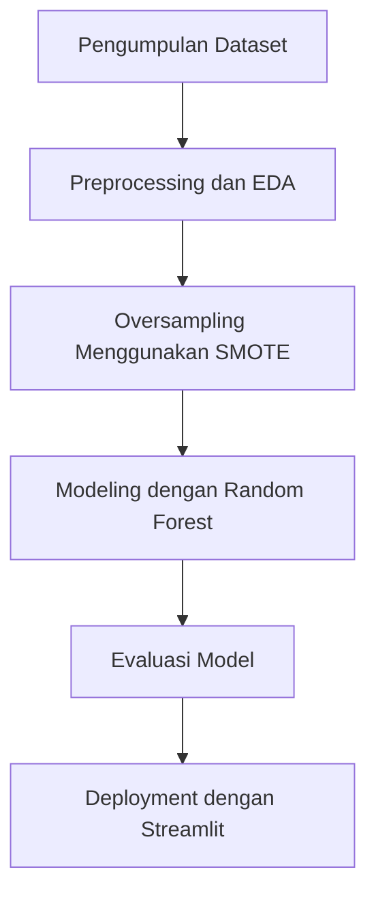

## **Judul/Topik Project**
Analisis dan Prediksi Distribusi Barang Menggunakan Random Forest

### **Identitas**
- **Nama**: Anggara Maheswara Eka Prawira Setyono
- **NIM**: A11.2022.14594
- **Kelas**: A11.4517
- **Mata Kuliah**: Data Mining

---

## **Ringkasan dan Permasalahan Project**
Proyek ini bertujuan untuk menganalisis dan memprediksi distribusi barang berdasarkan dataset pemasukan barang menggunakan algoritma Random Forest. Dengan model ini, diharapkan:

- Dapat mengatasi ketidakseimbangan data antar kategori barang.
- Memperoleh prediksi dengan akurasi tinggi.

### **Tujuan**
1. Menghasilkan model yang dapat memprediksi kategori barang dengan akurasi tinggi.
2. Meningkatkan pemahaman terkait pola distribusi barang melalui analisis data eksplorasi (EDA).
3. Memberikan solusi dalam pengambilan keputusan berbasis data.

### **Alur Penyelesaian Proyek**


---

## **Penjelasan Dataset**
### **Sumber Dataset**
Dataset diambil dari file "pemasukan barang.csv" yang berisi informasi:

- **Unnamed: 0**: Index dataset.
- **tanggal**: Tanggal pemasukan barang.
- **nama.barang**: Nama kategori barang.
- **kuantum**: Jumlah barang yang masuk.

### **Proses Features Dataset**
1. Menghapus kolom yang tidak relevan (e.g., `Unnamed: 0`, `tanggal`).
2. Menggunakan Label Encoding untuk kolom `nama.barang`.
3. Menggunakan SMOTE untuk menangani ketidakseimbangan data kategori barang.

---

## **Proses Learning / Modeling**
### **Metode yang Digunakan**
Algoritma Random Forest digunakan sebagai model prediksi, dengan langkah:

1. Membagi dataset menjadi 80% data latih dan 20% data uji.
2. Melakukan hyperparameter tuning menggunakan RandomizedSearchCV.
3. Melatih model dengan data yang telah di-oversample menggunakan SMOTE.

---

## **Performa Model**
### **Hasil Evaluasi**
- **Akurasi Model**: 1.0
- **Laporan Klasifikasi**:
```
               precision    recall  f1-score   support

           0       1.00      1.00      1.00         7
           1       1.00      1.00      1.00         1
           2       1.00      1.00      1.00         2
           3       1.00      1.00      1.00         2
           4       1.00      1.00      1.00         1

    accuracy                           1.00        13
   macro avg       1.00      1.00      1.00        13
weighted avg       1.00      1.00      1.00        13
```

- **Best Parameters dari RandomizedSearchCV**:
  ```json
  {
      "n_estimators": 50,
      "min_samples_split": 5,
      "min_samples_leaf": 2,
      "max_depth": 30,
      "bootstrap": false
  }
  ```

---

## **Diskusi Hasil dan Kesimpulan**
- Model berhasil mencapai akurasi 100% pada data uji, menunjukkan performa yang sangat baik.
- SMOTE efektif dalam mengatasi ketidakseimbangan data, sehingga model dapat memprediksi kategori minoritas dengan baik.
- Deployment dengan Streamlit memungkinkan model ini digunakan secara praktis untuk prediksi distribusi barang secara real-time.

---

## **Deployment**
Aplikasi Streamlit telah di-deploy secara online.

- **URL Aplikasi Streamlit**: http://192.168.1.11:8501
- **Contoh datasetnya**: https://drive.google.com/file/d/1c8d6AIJHLZRj4xzlJrtMM7pk5SCpA4lb/view?usp=sharing
